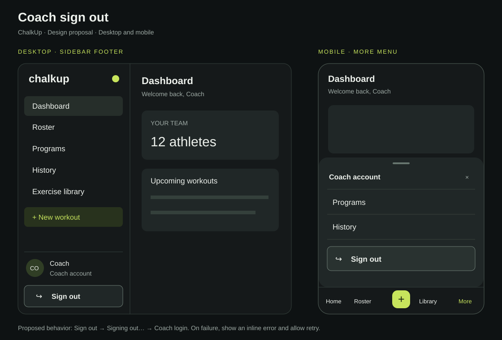

# Coach sign-out design proposal

Status: Awaiting user design confirmation. Do not merge until explicitly instructed.

## Problem
The current desktop Sidebar has an 11px sign-out link beneath the coach name. The mobile BottomNav More menu only exposes Programs and History, leaving no sign-out action there.

## Proposed UI
- Desktop: retain coach identity and replace the tiny text link with a full-width outlined Sign out button in the sidebar footer.
- Mobile: retain existing bottom navigation and add a Coach account heading and a clearly labelled Sign out row in the More sheet, below Programs and History.
- Use existing dark surfaces and lime navigation accent. Sign out uses a neutral outlined treatment.
- Minimum 48px button height; visible keyboard focus; accessible text label. The illustrative account name and dashboard data are placeholders.

## Behavior to implement after design confirmation
- Use the shared coach authentication flow; verify its error handling before implementation.
- Disable repeat submissions and show Signing out… while pending.
- Navigate to /login with history replacement only after successful sign-out.
- On failure, keep the user on the page and show an accessible inline error with retry.
- Verify protected coach routes cannot reopen after sign-out, including browser Back and refresh.
- Preserve existing unsaved-edit protections, if present.
- The mobile sheet needs accessible naming, focus management, Escape dismissal and focus return to More.

## Scope and validation
This PR contains a design mockup and specification only. It does not alter application code or authentication behavior.
Reviewed current Sidebar.jsx and BottomNav.jsx to match existing navigation.
SVG must remain valid XML and render at its native 1120×760 size.
Implementation validation after approval: desktop and mobile sign-out success, auth failure, repeated clicks, keyboard access, and protected-route behavior.
